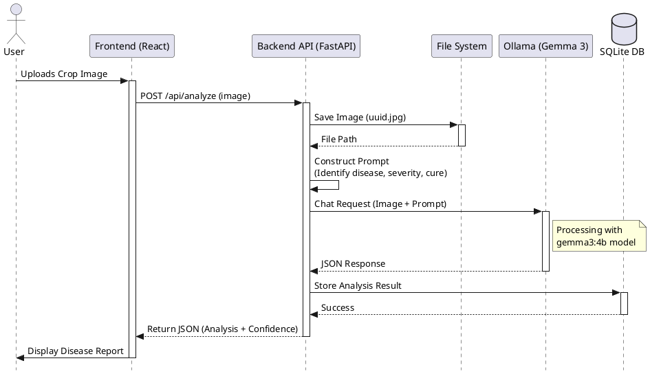
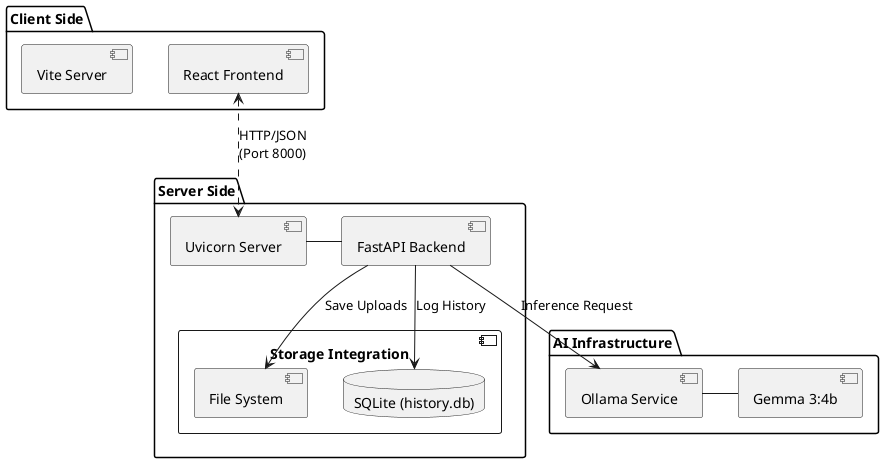
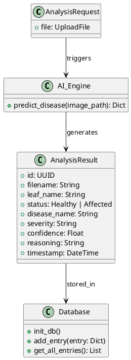

# 📊 System UML Diagrams (PlantUML)

This document contains **PlantUML** code for the project's architecture. You can render these diagrams using any PlantUML viewer or online editor (like [PlantText](https://www.planttext.com/)).

## 1. Sequence Diagram: Image Analysis Flow
This diagram shows the step-by-step process from uploading an image to receiving the disease analysis.

---

## 2. Component Diagram: System Architecture
This diagram illustrates the high-level components and their relationships.

## 3. Class Diagram: Backend Data Models
A simplified view of the data structure used in the backend.

